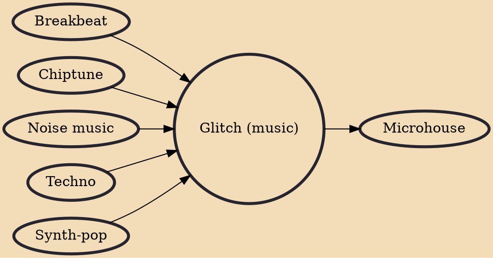

Glitch is a genre of electronic music that emerged in the 1990s. It is distinguished by the deliberate use of glitch-based audio media and other sonic artifacts. The glitching sounds featured in glitch tracks usually come from audio recording device or digital electronics malfunctions, such as CD skipping, electric hum, digital or analog distortion, circuit bending, bit-rate reduction, hardware noise, software bugs, computer crashes, vinyl record hiss or scratches, and system errors. Sometimes devices that were already broken are used, and sometimes devices are broken expressly for this purpose. In Computer Music Journal, composer and writer Kim Cascone classified glitch as a subgenre of electronica and used the term post-digital to describe the glitch aesthetic.

## Influences
- [[Breakbeat]]
- [[Chiptune]]
- [[Noise music]]
- [[Techno]]
- [[Synth-pop]]

## Derivatives
- [[Microhouse]]
