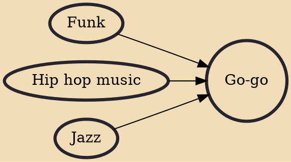

Go-go is a subgenre of funk music with an emphasis on specific rhythmic patterns, and live audience call and response. Go-go was originated by African-American musicians in the Washington, D.C. area during the mid-60s to late-70s. Go-go has limited popularity in other areas, but maintains a devoted audience in the Washington, D.C. metropolitan area as a uniquely regional music style and was named the official music of Washington, D.C. in February 2020.

## Influences

- [[Funk]]
- [[Hip hop music]]
- [[Jazz]]
