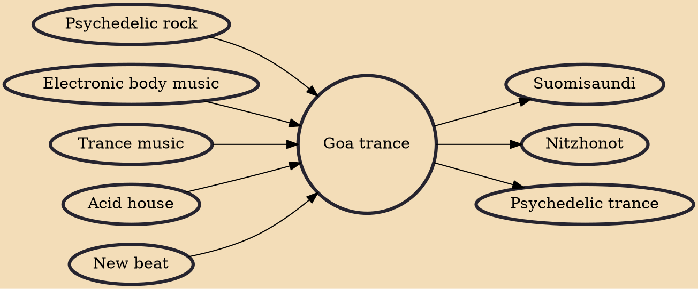

Goa trance is an electronic dance music style that originated in the early 1990s in the Indian state of Goa. Goa trance often has drone-like basslines, similar to the techno minimalism of 21st century psychedelic trance (psytrance). Psychedelic trance developed from Goa trance.

## Influences

- [[Psychedelic rock]]
- [[Electronic body music]]
- [[Trance music]]
- [[Acid house]]
- [[New beat]]

## Derivatives

- [[Suomisaundi]]
- [[Nitzhonot]]
- [[Psychedelic trance]]
