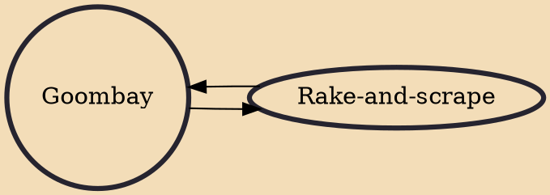

Goombay is a form of Bahamian music and a drum used to create it. The drum is a membranophone made with goat skin and played with the hands. The term Goombay has also symbolized an event in the Bahamas, for a summer festival with short parades known as ‘Junkanoo’. The goombay name has also evolved to become synonymous with local Afro-Caribbean music related to calypso. In The Bahamas, its most famous practitioner in modern times was Alphonso 'Blind Blake' Higgs, who performed at the Nassau International Airport for many years.

## Influences

- [[Rake-and-scrape]]

## Derivatives

- [[Rake-and-scrape]]
