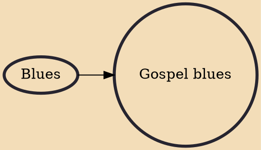

Gospel blues (or holy blues) is a form of blues-based gospel music that has been around since the inception of blues music. It combines evangelistic lyrics with blues instrumentation, often blues guitar accompaniment.

## Influences

- [[Blues]]
