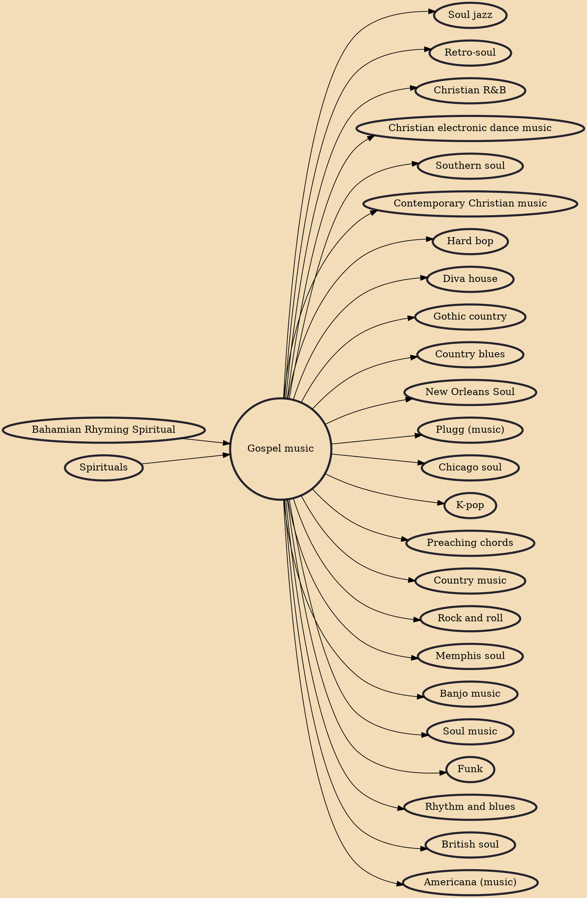

Gospel music is a traditional genre of Christian music, and a cornerstone of Christian media. The creation, performance, significance, and even the definition of gospel music varies according to culture and social context. Gospel music is composed and performed for many purposes, including aesthetic pleasure, religious or ceremonial purposes, and as an entertainment product for the marketplace. Gospel music is characterized by dominant vocals and strong use of harmony with Christian lyrics. Gospel music can be traced to the early 17th century.

## Influences

- [[Bahamian Rhyming Spiritual]]
- [[Spirituals]]

## Derivatives

- [[Soul jazz]]
- [[Retro-soul]]
- [[Christian R&B]]
- [[Christian electronic dance music]]
- [[Southern soul]]
- [[Contemporary Christian music]]
- [[Hard bop]]
- [[Diva house]]
- [[Gothic country]]
- [[Country blues]]
- [[New Orleans Soul]]
- [[Plugg (music)]]
- [[Chicago soul]]
- [[K-pop]]
- [[Preaching chords]]
- [[Country music]]
- [[Rock and roll]]
- [[Memphis soul]]
- [[Banjo music]]
- [[Soul music]]
- [[Funk]]
- [[Rhythm and blues]]
- [[British soul]]
- [[Americana (music)]]
