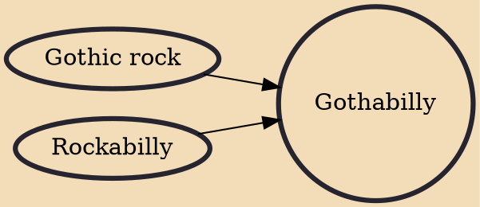

Gothabilly (sometimes hellbilly) is music genre influenced by rockabilly and goth subculture. The name is a portmanteau word that combines gothic and rockabilly, first used by the Cramps in the late 1970s to describe their somber blend of rockabilly and punk rock. Since then, the term has come to describe a fashion style influenced by gothic fashion, as seen in its use of black silks, satins, lace and velvet, corsets, top hats, antique jewellery, PVC, and leather.

## Influences
- [[Gothic rock]]
- [[Rockabilly]]
