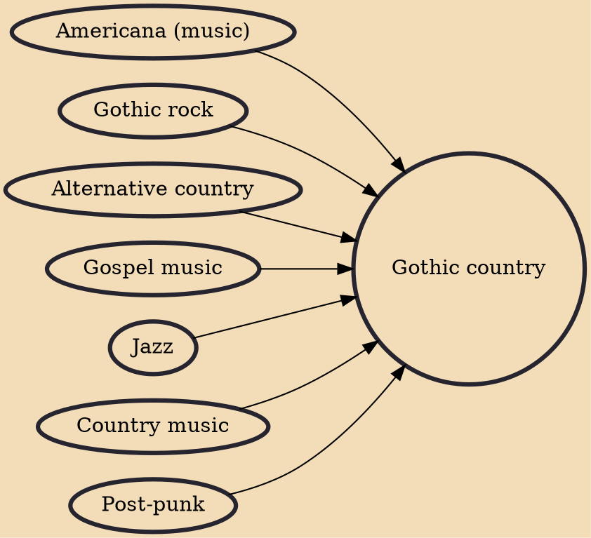

Gothic country (sometimes referred to as gothic Americana, Southern Gothic, the Denver sound, or even simply just dark country) is a genre of country music rooted in early jazz, gospel, Americana, gothic rock and post-punk. It's lyrics focus on dark subject matter. The genre has a regional scene in Denver.

## Influences
- [[Americana (music)]]
- [[Gothic rock]]
- [[Alternative country]]
- [[Gospel music]]
- [[Jazz]]
- [[Country music]]
- [[Post-punk]]
