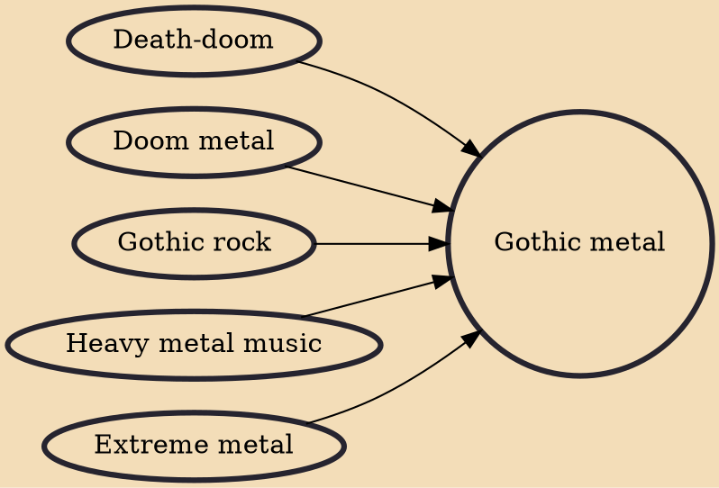

Gothic metal (or goth metal) is a fusion genre combining the aggression of heavy metal with the dark atmospheres of gothic rock. The music of gothic metal is diverse with bands known to adopt the gothic approach to different styles of heavy metal music. The genre originated during the early 1990s in the United Kingdom originally as an outgrowth of death-doom, a fusion of death metal and doom metal. Lyrics are generally dark and introspective with inspiration from gothic fiction as well as personal experiences.

## Influences

- [[Death-doom]]
- [[Doom metal]]
- [[Gothic rock]]
- [[Heavy metal music]]
- [[Extreme metal]]
