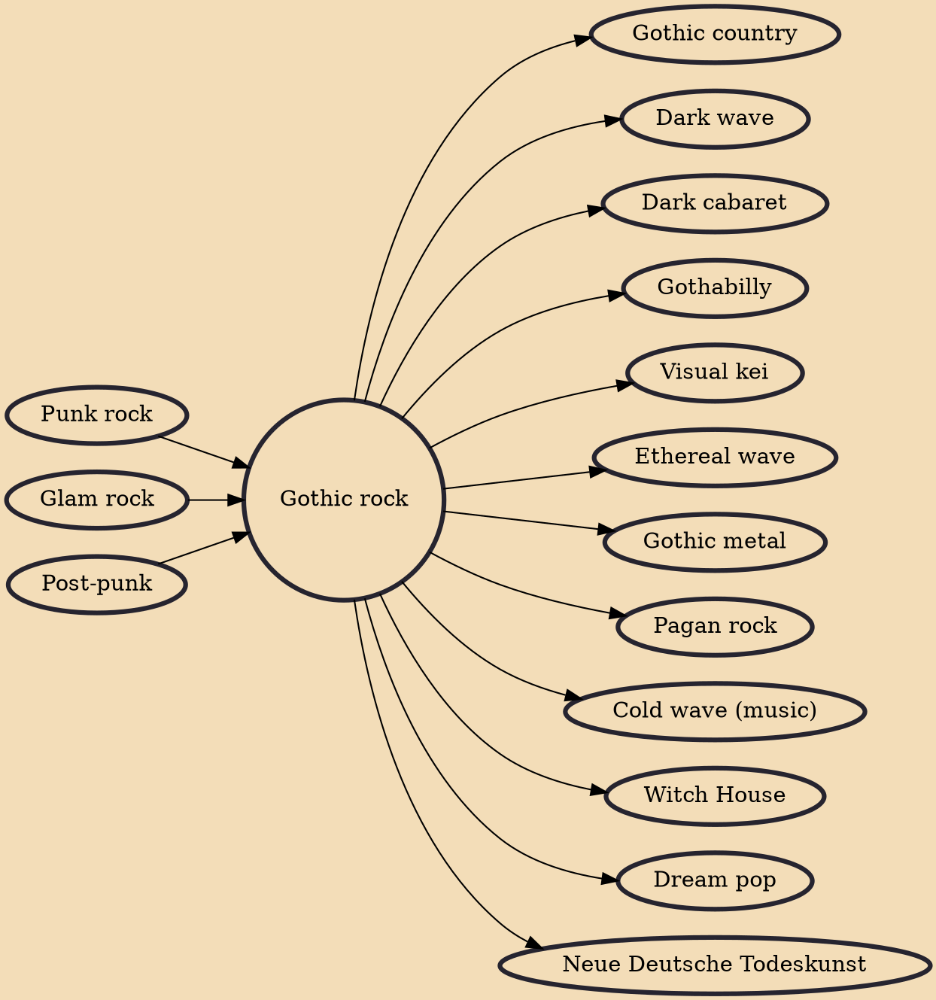

Gothic rock (also called goth rock or simply goth) is a style of rock music that emerged from post-punk in the United Kingdom in the late 1970s. The first post-punk bands which shifted toward dark music with gothic overtones include Siouxsie and the Banshees, Joy Division, Bauhaus, and the Cure.

## Influences

- [[Punk rock]]
- [[Glam rock]]
- [[Post-punk]]

## Derivatives

- [[Gothic country]]
- [[Dark wave]]
- [[Dark cabaret]]
- [[Gothabilly]]
- [[Visual kei]]
- [[Ethereal wave]]
- [[Gothic metal]]
- [[Pagan rock]]
- [[Cold wave (music)]]
- [[Witch House]]
- [[Dream pop]]
- [[Neue Deutsche Todeskunst]]
