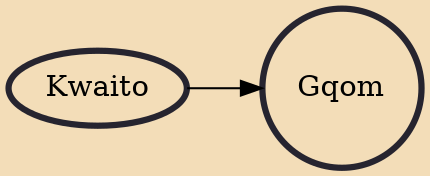

Gqom ([ᶢǃʱòm]) '(Igqomu) ([iᶢǃʱòmu]) is a genre of electronic dance music that emerged in the early 2010s from Durban, South Africa, pioneered largely by producer DJ Nathan_Medee, DJ Lag, Rudeboyz, Griffit Vigo, Mbreshcar SA and Citizen Boy. It was developed from kwaito, a subgenre of house music from South Africa. Unlike other South African electronic music, gqom is typified by minimal, raw and repetitive sound with heavy bass beats but without the four-on-the-floor rhythm pattern.Music connoisseurs who were pivotal in influencing the genre's international acclaim included the likes of South African rapper Okmalumkoolkat, Italian record label Gqom Oh owner, Malumz Kole inclusive of music taste-maker and public relations liaison, Cherish Lala Mankai, Afrotainment record label owner DJ Tira

## Influences
- [[Kwaito]]
