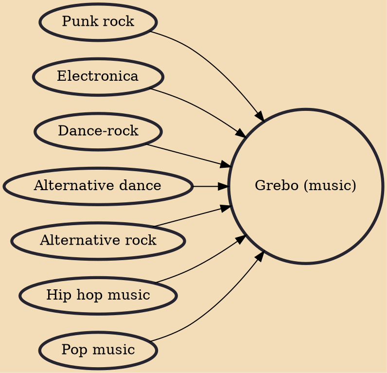

Grebo (or grebo rock) was a short-lived subgenre of alternative rock that incorporated influences from punk rock, electronic dance music, hip hop and psychedelia. The scene occupied the period in the late 1980s and early 1990s in the United Kingdom before the popularisation of Britpop and grunge. The genre and its attributes were largely absorbed into industrial rock, which would emerge after the sub-genre's demise in the late 1980s, which then led to the development of industrial metal in the 1990s.

## Influences
- [[Punk rock]]
- [[Electronica]]
- [[Dance-rock]]
- [[Alternative dance]]
- [[Alternative rock]]
- [[Hip hop music]]
- [[Pop music]]
