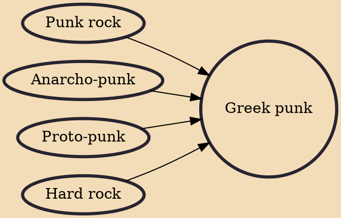

The Greek punk (Greek: Ελληνική πάνκ, pronounced [eliniˈki ˈpank]) scene was small but powerful in the Greek capital, Athens, in the 1980s. Bands such as Adiexodo (Dead end), Genia Tou Chaous (Chaos generation), , Panx Romana, , (Contra) functioned as a bunch of related bands, who gave concerts together, in the same locations. Like elsewhere, punk attitude has been loosely used by various individuals, but most of the times the key element was the youthful anger and the provocative anti-establishment attitude.

## Influences

- [[Punk rock]]
- [[Anarcho-punk]]
- [[Proto-punk]]
- [[Hard rock]]
