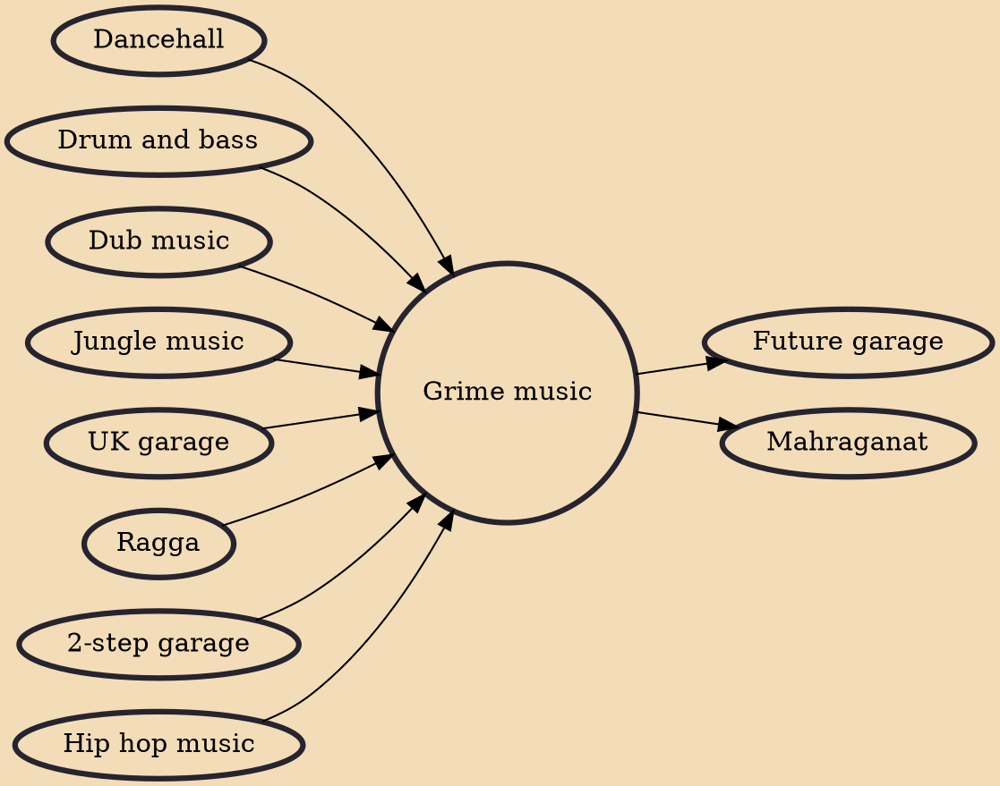

Grime is a genre of electronic music that emerged in London in the early 2000s. It developed out of the earlier UK dance style UK garage, and draws influences from jungle, dancehall, and hip hop. The style is typified by rapid, syncopated breakbeats, generally around 140 beats per minute, and often features an aggressive or jagged electronic sound. Emceeing is a significant element of the style, and lyrics often revolve around gritty depictions of urban life. Grime is generally considered to be distinct from hip hop due to its roots primarily being genres such as UK garage and jungle.

## Influences

- [[Dancehall]]
- [[Drum and bass]]
- [[Dub music]]
- [[Jungle music]]
- [[UK garage]]
- [[Ragga]]
- [[2-step garage]]
- [[Hip hop music]]

## Derivatives

- [[Future garage]]
- [[Mahraganat]]
