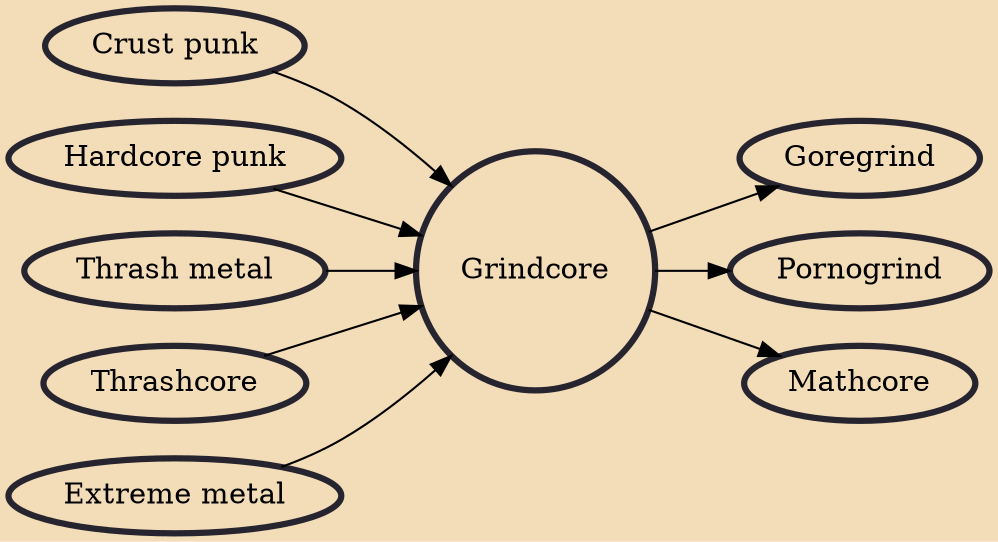

Grindcore is an extreme fusion genre of heavy metal and hardcore punk that originated in the mid-1980s, drawing inspiration from abrasive-sounding musical styles, such as thrashcore, crust punk, hardcore punk, extreme metal, and industrial. Grindcore is considered a more noise-filled style of hardcore punk while using hardcore's trademark characteristics such as heavily distorted, down-tuned guitars, grinding overdriven bass, high-speed tempo, blast beats, and vocals which consist of growls, shouts and high-pitched shrieks. Early groups like Napalm Death are credited with laying the groundwork for the style. It is most prevalent today in North America and Europe, with popular contributors such as Brutal Truth and Nasum. Lyrical themes range from a primary focus on social and political conc

## Influences

- [[Crust punk]]
- [[Hardcore punk]]
- [[Thrash metal]]
- [[Thrashcore]]
- [[Extreme metal]]

## Derivatives

- [[Goregrind]]
- [[Pornogrind]]
- [[Mathcore]]
