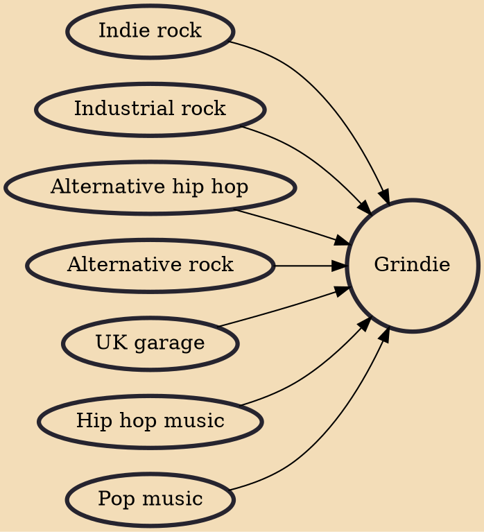

Grindie, also known as grime-indie or grime indie, is a form of music that emerged in early 2006. It is a fusion of indie rock or alternative rock and grime music.

## Influences

- [[Indie rock]]
- [[Industrial rock]]
- [[Alternative hip hop]]
- [[Alternative rock]]
- [[UK garage]]
- [[Hip hop music]]
- [[Pop music]]
