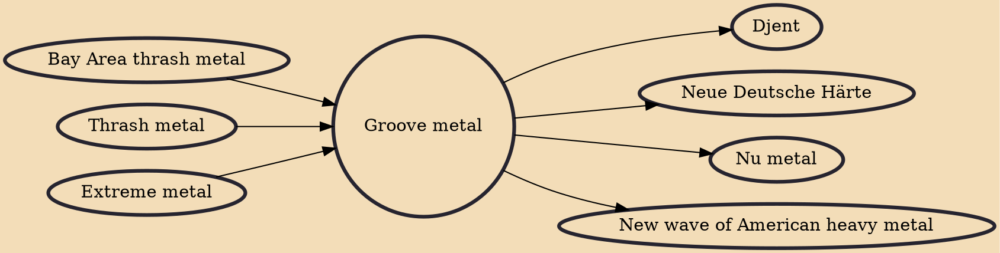

Groove metal is a subgenre of heavy metal music that began in the early 1990s. The genre achieved success in the 1990s and continued having success in the 2000s. Inspired by thrash metal and traditional heavy metal, groove metal features raspy singing and screaming, down-tuned guitars, heavy guitar riffs, and syncopated rhythms. Unlike thrash metal, groove metal is usually slower and also uses elements of traditional heavy metal. Pantera are often considered the pioneers of groove metal, and groove metal expanded in the 1990s with bands like White Zombie, Machine Head, and Sepultura. The genre continued in the 2000s with bands like Lamb of God, DevilDriver, and Five Finger Death Punch.

## Influences
- [[Bay Area thrash metal]]
- [[Thrash metal]]
- [[Extreme metal]]

## Derivatives
- [[Djent]]
- [[Neue Deutsche Härte]]
- [[Nu metal]]
- [[New wave of American heavy metal]]
