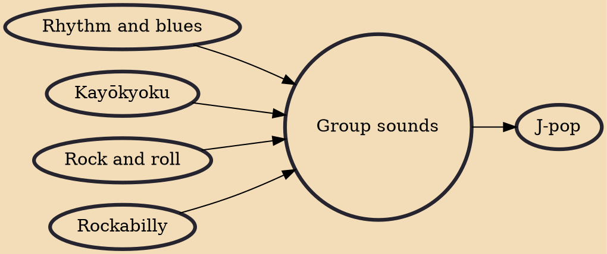

Group sounds (Japanese: グループ・サウンズ, Hepburn: Gurūpu Saunzu), often abbreviated as GS, is a genre of Japanese rock music which became popular in the mid to late 1960s and initiated the fusion of Japanese kayōkyoku music and Western rock music. Their music production techniques were regarded as playing a pioneering role in modern Japanese popular music.

## Influences

- [[Rhythm and blues]]
- [[Kayōkyoku]]
- [[Rock and roll]]
- [[Rockabilly]]

## Derivatives

- [[J-pop]]
