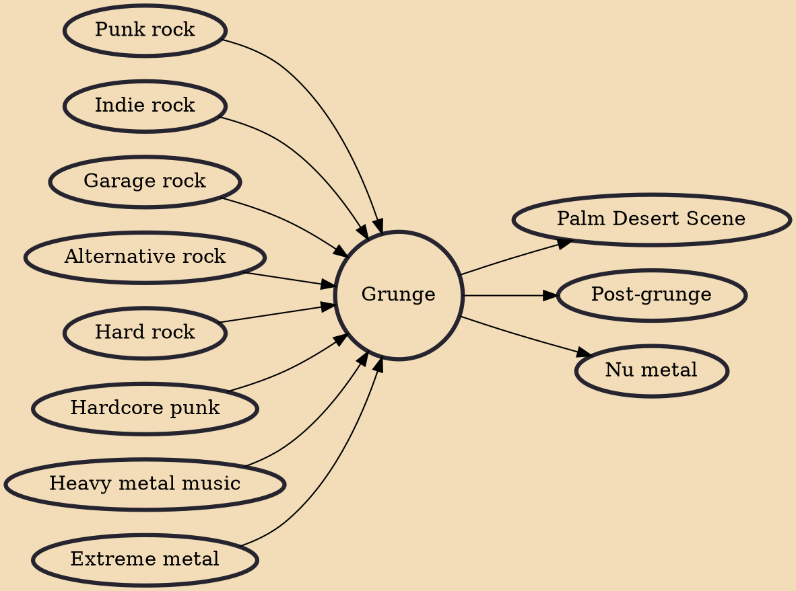

Grunge (sometimes referred to as the Seattle sound) is an alternative rock genre and subculture that emerged during the mid-1980s in the American Pacific Northwest state of Washington, particularly in Seattle and nearby towns. Grunge fuses elements of punk rock and heavy metal, but without punk's structure and speed. The genre featured the distorted electric guitar sound used in both genres, although some bands performed with more emphasis on one or the other. Like these genres, grunge typically uses electric guitar, bass guitar, drums and vocals. Grunge also incorporates influences from indie rock bands such as Sonic Youth. Lyrics are typically angst-filled and introspective, often addressing themes such as social alienation, self-doubt, abuse, neglect, betrayal, social and emotional isol

## Influences

- [[Punk rock]]
- [[Indie rock]]
- [[Garage rock]]
- [[Alternative rock]]
- [[Hard rock]]
- [[Hardcore punk]]
- [[Heavy metal music]]
- [[Extreme metal]]

## Derivatives

- [[Palm Desert Scene]]
- [[Post-grunge]]
- [[Nu metal]]
