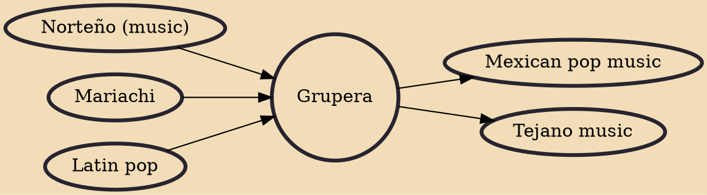

Grupera (also known as Grupero or Onda Grupera) is a genre of Regional Mexican music. It reached the height of its popularity in the 1990s, especially in rural areas. The music has roots in the rock groups of the 1960s, but today generally consists of four or more musicians using electric guitars, keyboards and drums. The music increased in popularity in the 1980s and became commercially viable, and is now recognized in some Latin music awards ceremonies such as Lo Nuestro and The Latin Grammy Awards. Grupero artists typically perform rancheras, corridos, cumbias, charangas, ballads, boleros and chilenas/huapangos.

## Influences

- [[Norteño (music)]]
- [[Mariachi]]
- [[Latin pop]]

## Derivatives

- [[Mexican pop music]]
- [[Tejano music]]
