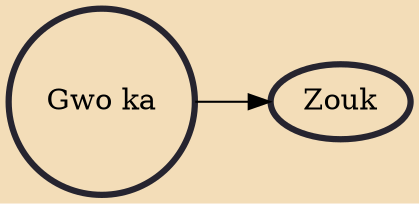

Gwo ka is a French creole term for big drum. Alongside Gwotanbou, simply Ka or Banboula (archaic), it refers to both a family of hand drums and the music played with them, which is a major part of Guadeloupean folk music. Moreover, the term is occasionally found in reference to the small, flat-bottomed tambourine (tanbou d'bas) played in kadri music, or even simply to drum (tanbou) in general. The Gwo Ka musical practice emerged in the seventeenth century, during the transatlantic slave trade

## Derivatives
- [[Zouk]]
