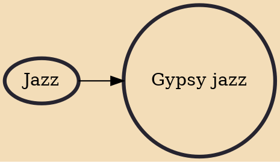

Gypsy jazz (also known as gypsy swing, jazz manouche or hot club-style jazz) is a style of small-group jazz originating from the Romani guitarist Jean "Django" Reinhardt (1910–53), in conjunction with the French swing violinist Stéphane Grappelli (1908–97), as expressed in their group the Quintette du Hot Club de France. Because its origins are in France, Reinhardt was from the Manouche (French Sinti) clan, and the style has remained popular amongst the Manouche, gypsy jazz is often called by the French name "jazz manouche", or alternatively, "manouche jazz" in English language sources. Some scholars have noted that the style was not named manouche until the late 1960s; the name "gypsy jazz" began to be used around the late 1990s.

## Influences

- [[Jazz]]
