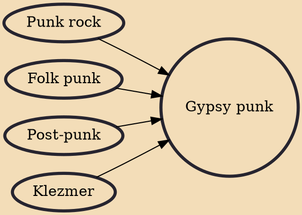

Gypsy punk is a hybrid musical genre that crosses traditional Romani music with punk rock. One of the first rock groups to incorporate elements of punk and Roma music was Motherhead Bug, which was active mostly in the early 1990s. A broader audience became aware of the genre after the band Gogol Bordello released the album Gypsy Punks: Underdog World Strike, with front man Eugene Hütz describing their performance as a "Gypsy Punk Cabaret".

## Influences

- [[Punk rock]]
- [[Folk punk]]
- [[Post-punk]]
- [[Klezmer]]
