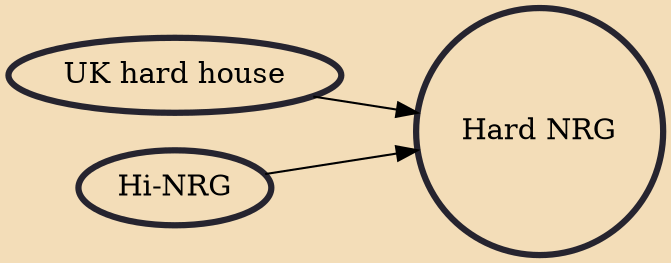

Hard NRG, NRG, nu-NRG, filthy hard house, or more recently just filth, is an electronic dance music genre similar in structure (with regard to sequencing and programming) to UK hard house. The main difference is in the musical/thematic content of each style. Where UK hard house has uplifting, playfully fun and tough elements, NRG is ominous, dark, aggressive and relentless with its distressed, menacing and gritty sounds on a slightly faster BPM (155–165 average) than UK hard house (150–155 average).

## Influences
- [[UK hard house]]
- [[Hi-NRG]]
