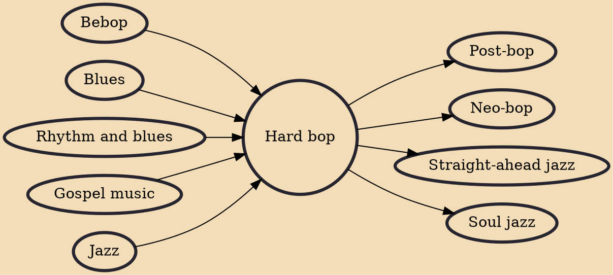

Hard bop is a subgenre of jazz that is an extension of bebop (or "bop") music. Journalists and record companies began using the term in the mid-1950s to describe a new current within jazz that incorporated influences from rhythm and blues, gospel music, and blues, especially in saxophone and piano playing.

## Influences
- [[Bebop]]
- [[Blues]]
- [[Rhythm and blues]]
- [[Gospel music]]
- [[Jazz]]

## Derivatives
- [[Post-bop]]
- [[Neo-bop]]
- [[Straight-ahead jazz]]
- [[Soul jazz]]
