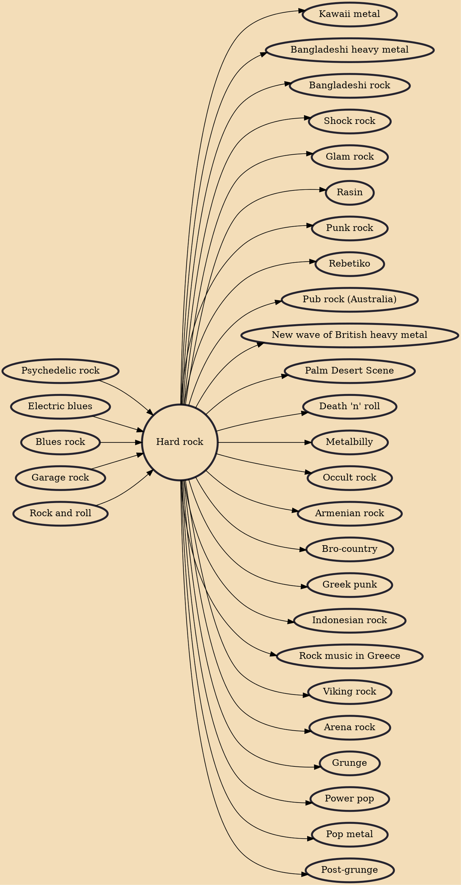

Hard rock or heavy rock is a loosely defined subgenre of rock music typified by aggressive vocals and distorted electric guitars. Hard rock began in the mid-1960s with the garage, psychedelic and blues rock movements. Some of the earliest hard rock music was produced by the Kinks, the Who, the Rolling Stones, Cream and the Jimi Hendrix Experience. In the late 1960s, bands such as the Jeff Beck Group, Iron Butterfly, Led Zeppelin, Golden Earring, Steppenwolf and Deep Purple also produced hard rock.

## Influences

- [[Psychedelic rock]]
- [[Electric blues]]
- [[Blues rock]]
- [[Garage rock]]
- [[Rock and roll]]

## Derivatives

- [[Kawaii metal]]
- [[Bangladeshi heavy metal]]
- [[Bangladeshi rock]]
- [[Shock rock]]
- [[Glam rock]]
- [[Rasin]]
- [[Punk rock]]
- [[Rebetiko]]
- [[Pub rock (Australia)]]
- [[New wave of British heavy metal]]
- [[Palm Desert Scene]]
- [[Death 'n' roll]]
- [[Metalbilly]]
- [[Occult rock]]
- [[Armenian rock]]
- [[Bro-country]]
- [[Greek punk]]
- [[Indonesian rock]]
- [[Rock music in Greece]]
- [[Viking rock]]
- [[Arena rock]]
- [[Grunge]]
- [[Power pop]]
- [[Pop metal]]
- [[Post-grunge]]
