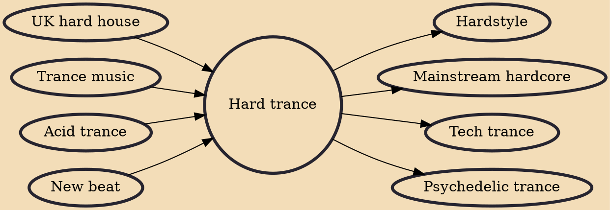

Hard trance is a subgenre of trance music which originated in Western Europe (Belgium, Germany and The Netherlands) in the early 1990s as the Breakbeat hardcore production community began to diversify into new and different styles of electronic music, all influenced by Hard house, New beat, Happy hardcore and Jungle music. The popularity of hard trance peaked during the late 1990s and has since then faded in scope of newer forms of trance.

## Influences

- [[UK hard house]]
- [[Trance music]]
- [[Acid trance]]
- [[New beat]]

## Derivatives

- [[Hardstyle]]
- [[Mainstream hardcore]]
- [[Tech trance]]
- [[Psychedelic trance]]
