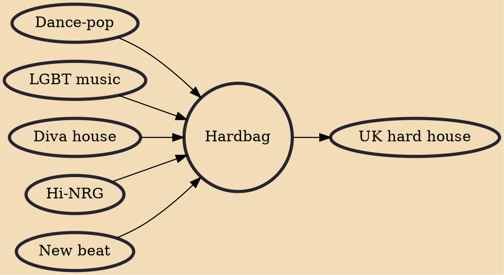

Hardbag is a genre of electronic dance music popular in the mid-1990s. Having evolved out of the handbag house scene in 1993–1994, the genre enjoyed massive, albeit brief, popularity, with several hardbag releases achieving positions in the upper echelons of the UK chart. It was at the time sometimes confused with nu-NRG, yet the styles were discernibly different.

## Influences
- [[Dance-pop]]
- [[LGBT music]]
- [[Diva house]]
- [[Hi-NRG]]
- [[New beat]]

## Derivatives
- [[UK hard house]]
