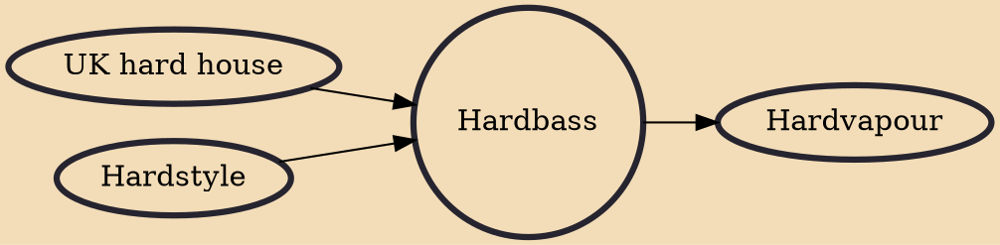

Hardbass or hard bass (Russian: хардбас(с), tr. khardbas(s), IPA: [xɐrdˈbas]) is a subgenre of pumping house that originated in Saint Petersburg, Russia during the late 1990s, drawing inspiration from bouncy techno, hardstyle, as well as local Russian influences. Hardbass is characterized by its fast tempo (usually 150–175 BPM), donks, distinctive basslines (commonly known as "hard bounce"), distorted sounds, heavy kicks and occasional chants or rapping. In several European countries, so-called "hardbass scenes" have sprung up, which are events related to the genre that involve multiple people dancing in public while masked, sometimes with moshing involved.

## Influences
- [[UK hard house]]
- [[Hardstyle]]

## Derivatives
- [[Hardvapour]]
