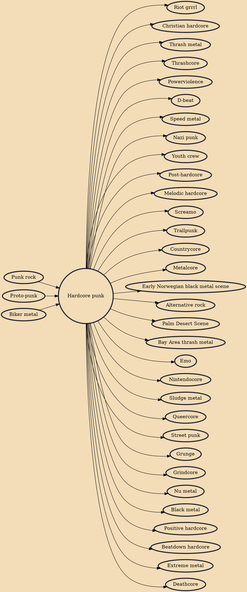

Hardcore punk (also known as simply hardcore) is a punk rock music genre and subculture that originated in the late 1970s. It is generally faster, harder, and more aggressive than other forms of punk rock. Its roots can be traced to earlier punk scenes in San Francisco and Southern California which arose as a reaction against the still predominant hippie cultural climate of the time. It was also inspired by Washington D.C. and New York punk rock and early proto-punk. Hardcore punk generally disavows commercialism, the established music industry and "anything similar to the characteristics of mainstream rock" and often addresses social and political topics with "confrontational, politically-charged lyrics."

## Influences

- [[Punk rock]]
- [[Proto-punk]]
- [[Biker metal]]

## Derivatives

- [[Riot grrrl]]
- [[Christian hardcore]]
- [[Thrash metal]]
- [[Thrashcore]]
- [[Powerviolence]]
- [[D-beat]]
- [[Speed metal]]
- [[Nazi punk]]
- [[Youth crew]]
- [[Post-hardcore]]
- [[Melodic hardcore]]
- [[Screamo]]
- [[Trallpunk]]
- [[Countrycore]]
- [[Metalcore]]
- [[Early Norwegian black metal scene]]
- [[Alternative rock]]
- [[Palm Desert Scene]]
- [[Bay Area thrash metal]]
- [[Emo]]
- [[Nintendocore]]
- [[Sludge metal]]
- [[Queercore]]
- [[Street punk]]
- [[Grunge]]
- [[Grindcore]]
- [[Nu metal]]
- [[Black metal]]
- [[Positive hardcore]]
- [[Beatdown hardcore]]
- [[Extreme metal]]
- [[Deathcore]]
