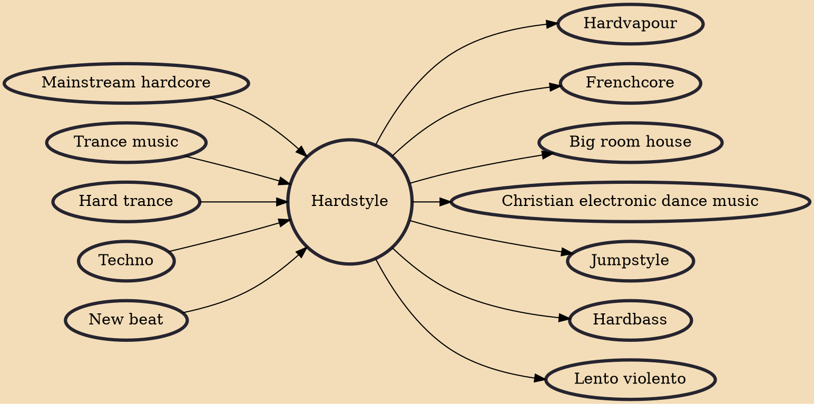

Hardstyle is an electronic dance genre that emerged in the late 1990s, with origins in the Netherlands, Belgium and Italy. Hardstyle mixes influences from techno, new beat and hardcore. Early hardstyle was typically written at 140 BPM (beats per minute), however modern hardstyle is faster, produced around 150 BPM. It consisted of overdriven and hard-sounding kick drums, often accompanied by an offbeat bass, known as a "reverse bass". As the genre grew, the production techniques and songwriting changed to be suited to a more commercial audience. Modern hardstyle can be recognized by its use of synthesizer melodies and distorted sounds, coupled with hardstyle's signature combination of percussion and bass. The genre is particularly known for its harmonic use of kickdrums. Due to the sustaine

## Influences

- [[Mainstream hardcore]]
- [[Trance music]]
- [[Hard trance]]
- [[Techno]]
- [[New beat]]

## Derivatives

- [[Hardvapour]]
- [[Frenchcore]]
- [[Big room house]]
- [[Christian electronic dance music]]
- [[Jumpstyle]]
- [[Hardbass]]
- [[Lento violento]]
