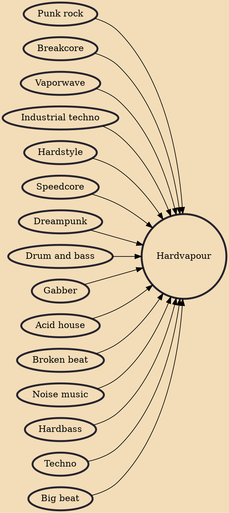

Hardvapour is an Internet-based microgenre of music that emerged in late 2015 as a tongue-in-cheek response to vaporwave, departing from the calm, muzak-sampling capitalist utopia concept of the latter in favor of a gabber- and punk-influenced sound. Canadian music producer Wolfenstein OS X album End of World Rave (2015) and the Antifur record label are credited with having first defined the hardvapour sound. It is also related to vaportrap.

## Influences

- [[Punk rock]]
- [[Breakcore]]
- [[Vaporwave]]
- [[Industrial techno]]
- [[Hardstyle]]
- [[Speedcore]]
- [[Dreampunk]]
- [[Drum and bass]]
- [[Gabber]]
- [[Acid house]]
- [[Broken beat]]
- [[Noise music]]
- [[Hardbass]]
- [[Techno]]
- [[Big beat]]
