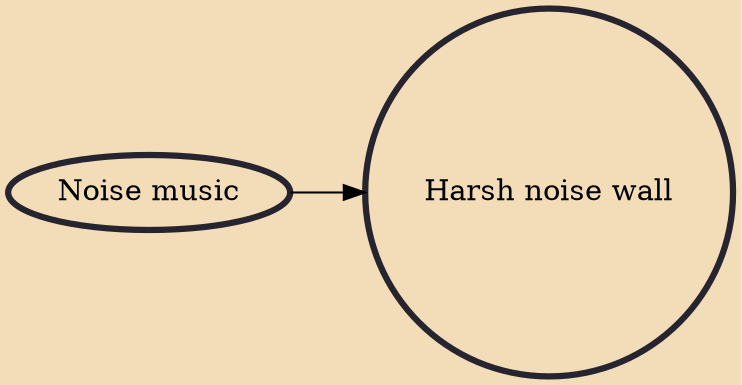

Harsh noise wall, also known as wall noise or HNW, is an extreme subgenre of noise music, described as "a literal consistent, unflinching and enveloping wall of monolithic noise." The movement is spearheaded by French musician Vomir, who described his aesthetic as "no ideas, no change, no development, no entertainment, no remorse". The genre soon gained traction in the United States. Artists such as the Haters, Daniel Menche, and Richard Ramirez are best know for popularizing the noise genre in the US.

## Influences

- [[Noise music]]
