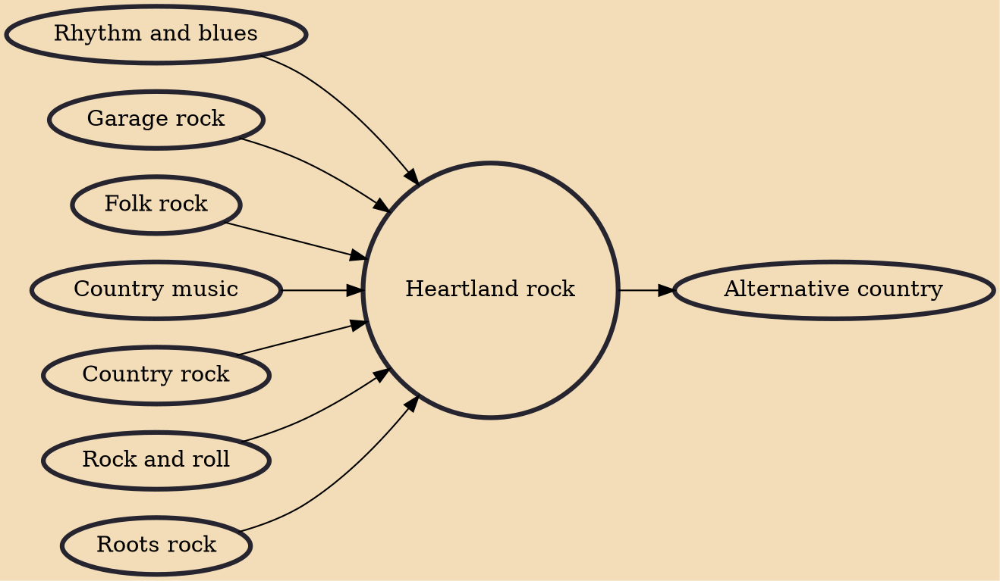

Heartland rock is a genre of rock music characterized by a straightforward, often roots musical style, often with a focus on blue-collar workers, and a conviction that rock music has a social or communal purpose beyond just entertainment.

## Influences
- [[Rhythm and blues]]
- [[Garage rock]]
- [[Folk rock]]
- [[Country music]]
- [[Country rock]]
- [[Rock and roll]]
- [[Roots rock]]

## Derivatives
- [[Alternative country]]
