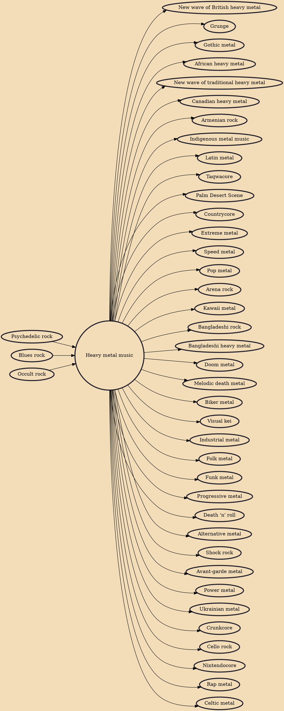

Heavy metal (or simply metal) is a genre of rock music that developed in the late 1960s and early 1970s, largely in the United Kingdom and United States. With roots in blues rock, psychedelic rock and acid rock, heavy metal bands developed a thick, monumental sound characterized by distorted guitars, extended guitar solos, emphatic beats and loudness.

## Influences
- [[Psychedelic rock]]
- [[Blues rock]]
- [[Occult rock]]

## Derivatives
- [[New wave of British heavy metal]]
- [[Grunge]]
- [[Gothic metal]]
- [[African heavy metal]]
- [[New wave of traditional heavy metal]]
- [[Canadian heavy metal]]
- [[Armenian rock]]
- [[Indigenous metal music]]
- [[Latin metal]]
- [[Taqwacore]]
- [[Palm Desert Scene]]
- [[Countrycore]]
- [[Extreme metal]]
- [[Speed metal]]
- [[Pop metal]]
- [[Arena rock]]
- [[Kawaii metal]]
- [[Bangladeshi rock]]
- [[Bangladeshi heavy metal]]
- [[Doom metal]]
- [[Melodic death metal]]
- [[Biker metal]]
- [[Visual kei]]
- [[Industrial metal]]
- [[Folk metal]]
- [[Funk metal]]
- [[Progressive metal]]
- [[Death 'n' roll]]
- [[Alternative metal]]
- [[Shock rock]]
- [[Avant-garde metal]]
- [[Power metal]]
- [[Ukrainian metal]]
- [[Crunkcore]]
- [[Cello rock]]
- [[Nintendocore]]
- [[Rap metal]]
- [[Celtic metal]]
