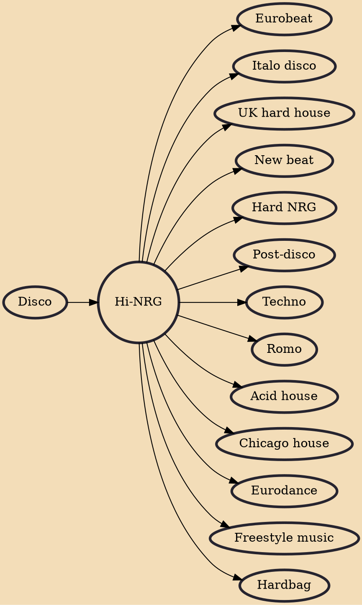

Hi-NRG (pronounced "high energy") is a genre of uptempo disco or electronic dance music (EDM) that originated in the United States during the late 1970s and early 1980s. As a music genre, typified by fast tempo, staccato hi-hat rhythms (and the four-on-the-floor pattern), reverberated "intense" vocals and "pulsating" octave basslines, it was particularly influential on the disco scene. Its earliest association was with Italo disco.

## Influences
- [[Disco]]

## Derivatives
- [[Eurobeat]]
- [[Italo disco]]
- [[UK hard house]]
- [[New beat]]
- [[Hard NRG]]
- [[Post-disco]]
- [[Techno]]
- [[Romo]]
- [[Acid house]]
- [[Chicago house]]
- [[Eurodance]]
- [[Freestyle music]]
- [[Hardbag]]
