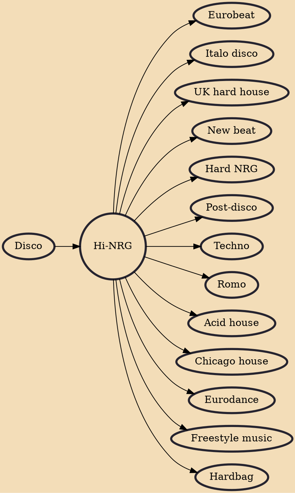

Emerging in the late 1970s and reaching its peak during the 1980s, Hi-NRG (High Energy) is a genre that evolved from the disco era. It incorporated the driving rhythm and pulsating beats of disco music but introduced a faster tempo and more intense electronic elements. Hi-NRG's lively and energetic nature made it an instant hit within dance clubs, where its infectious grooves encouraged frenetic movement and exhilarating dance routines.

Hi-NRG music continues to be celebrated for its high-energy, captivating beats, and electrifying sound. It has influenced subsequent electronic dance music genres, leaving an enduring legacy that continues to inspire artists and fuel dance floors worldwide.

## Key Characteristics

Hi-NRG is instantly recognisable due to its distinct characteristics:

### High Tempo

One of the defining features of Hi-NRG is its rapid tempo, often ranging from 120 to 140 beats per minute (BPM) and even higher. This brisk pace propels listeners onto the dance floor with an urgency that is hard to resist.

### Energetic Beats

The genre employs a driving beat that pulses through the music, creating an adrenaline-fueled atmosphere. The beats are designed to keep dancers moving and engaged throughout the song.

### Electronic Elements

Hi-NRG embraced electronic instrumentation, incorporating synthesizers, drum machines, and other technological advancements of the time. These elements gave the genre a futuristic and cutting-edge feel.

### Powerful Vocals

Hi-NRG vocalists often deliver their lyrics with intense emotion and energy, perfectly complementing the music's high-octane nature.

## Artists and Songs

Several artists and songs have come to epitomise the Hi-NRG genre:

1. [Donna Summer](https://amzn.to/3KBuyW1) - "I Feel Love": Often dubbed the "Queen of Disco," Donna Summer's "I Feel Love" (1977) is a groundbreaking track that not only paved the way for Hi-NRG but also became a touchstone for electronic dance music.
2. [Patrick Cowley](https://amzn.to/3QTTSun) - "Menergy": Considered one of the pioneers of Hi-NRG, Patrick Cowley's "Menergy" (1981) is a quintessential track that exemplifies the genre's synthesis of disco and electronic elements.
3. [Divine](https://amzn.to/3Z0vbys) - "You Think You're a Man": Divine's "You Think You're a Man" (1984) is a prime example of Hi-NRG's bold and unapologetic style, featuring powerful vocals and an irresistibly catchy beat.
4. [Evelyn Thomas](https://amzn.to/3PeO1yj) - "High Energy": As the genre's namesake, Evelyn Thomas's "High Energy" (1984) is a definitive anthem that showcases the fast-paced, electrifying essence of Hi-NRG.
5. [Dead or Alive](https://amzn.to/3s4IqSd) - "You Spin Me Round (Like a Record)": This iconic track by Dead or Alive became a global hit with its pulsating rhythm, dynamic vocals, and memorable hooks.
6. [The Flirts](https://amzn.to/3L17nER) - "Passion": The Flirts' "Passion" (1982) captures the essence of Hi-NRG with its energetic tempo, synth-driven melodies, and lively vocal delivery.

## Influences

- [[Disco]]

## Derivatives

- [[Eurobeat]]
- [[Italo disco]]
- [[UK hard house]]
- [[New beat]]
- [[Hard NRG]]
- [[Post-disco]]
- [[Techno]]
- [[Romo]]
- [[Acid house]]
- [[Chicago house]]
- [[Eurodance]]
- [[Freestyle music]]
- [[Hardbag]]
