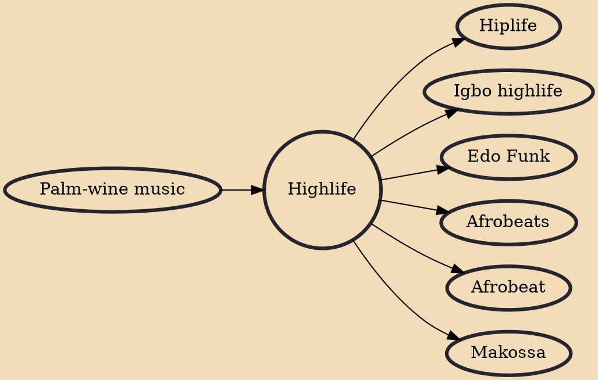

Highlife is a music genre that started in present-day Ghana in the 19th century, during its history as a colony of the British Empire and through its trade routes in coastal areas. It describes multiple local fusions of African metre and western jazz melodies. It uses the melodic and main rhythmic structures of traditional Akan music, Kpanlogo Music of the Ga people, but is typically played with Western instruments. Highlife is characterized by jazzy horns and multiple guitars which lead the band and its use of the two-finger plucking guitar style that is typical of African music. Recently it has acquired an uptempo, synth-driven sound.

## Influences

- [[Palm-wine music]]

## Derivatives

- [[Hiplife]]
- [[Igbo highlife]]
- [[Edo Funk]]
- [[Afrobeats]]
- [[Afrobeat]]
- [[Makossa]]
