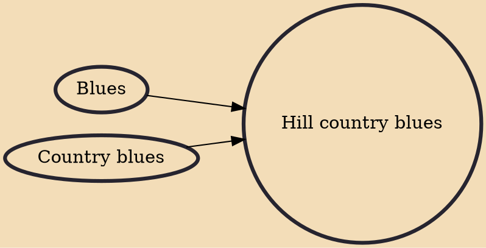

Hill country blues (also known as North Mississippi hill country blues or North Mississippi blues) is a regional style of country blues. It is characterized by a strong emphasis on rhythm and percussion, steady guitar riffs, few chord changes, unconventional song structures, and heavy emphasis on the "groove", which has been characterized as the "hypnotic boogie".

## Influences

- [[Blues]]
- [[Country blues]]
