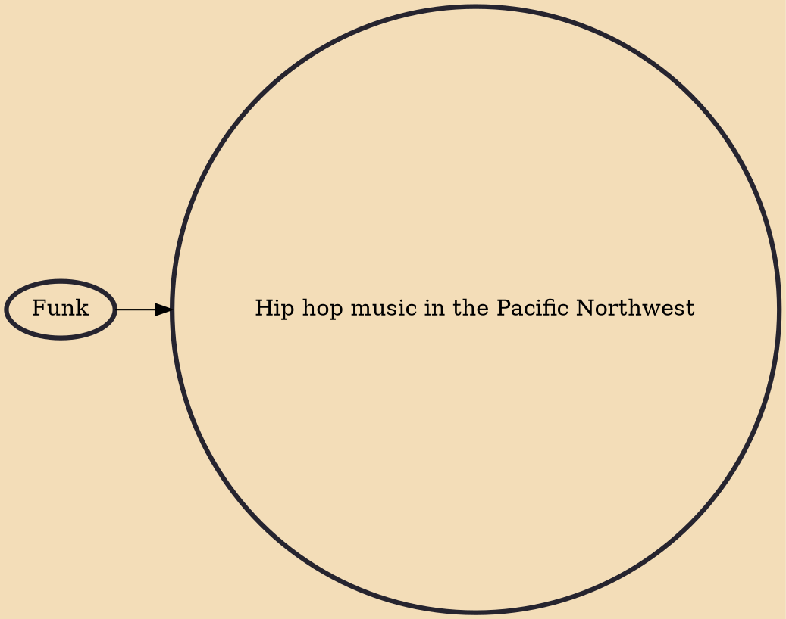

Northwest hip hop is hip hop or rap music that originates from the Pacific Northwest of North America, encompassing major cities such as Portland (Oregon), Seattle (Washington), and other towns. Northwest hip hop music mixes elements from various genres of music to form a sound different from its southern neighbor, West Coast hip hop. For many years the scene existed mainly as an underground genre, but recently Northwest hip-hop has seen more and more mainstream acceptance, with artists such as Macklemore gaining nationwide attention.

## Influences
- [[Funk]]
