```dot
digraph {
	graph [bgcolor="#F3DDB8" rankdir=LR]
	node [color="#26242F" penwidth=3.0]
	"Hip hop music" [shape=circle]
	"Rhythm and blues" [URL="/rhythm-and-blues/"]
	"Rhythm and blues" -> "Hip hop music"
	"Deep funk" [URL="/deep-funk/"]
	"Deep funk" -> "Hip hop music"
	"Electronic music" [URL="/electronic-music/"]
	"Electronic music" -> "Hip hop music"
	Dancehall [URL="/dancehall/"]
	Dancehall -> "Hip hop music"
	Funk [URL="/funk/"]
	Funk -> "Hip hop music"
	"Dub music" [URL="/dub-music/"]
	"Dub music" -> "Hip hop music"
	Reggae [URL="/reggae/"]
	Reggae -> "Hip hop music"
	Jazz [URL="/jazz/"]
	Jazz -> "Hip hop music"
	Disco [URL="/disco/"]
	Disco -> "Hip hop music"
	Mahraganat [URL="/mahraganat/"]
	"Hip hop music" -> Mahraganat
	"Funk carioca" [URL="/funk-carioca/"]
	"Hip hop music" -> "Funk carioca"
	Sampledelia [URL="/sampledelia/"]
	"Hip hop music" -> Sampledelia
	"Kenyan hip hop" [URL="/kenyan-hip-hop/"]
	"Hip hop music" -> "Kenyan hip hop"
	"Low bap" [URL="/low-bap/"]
	"Hip hop music" -> "Low bap"
	"Malaysian hip hop" [URL="/malaysian-hip-hop/"]
	"Hip hop music" -> "Malaysian hip hop"
	Downtempo [URL="/downtempo/"]
	"Hip hop music" -> Downtempo
	"K-pop" [URL="/k-pop/"]
	"Hip hop music" -> "K-pop"
	Reggaeton [URL="/reggaeton/"]
	"Hip hop music" -> Reggaeton
	"Bleep techno" [URL="/bleep-techno/"]
	"Hip hop music" -> "Bleep techno"
	"Serbian hip hop" [URL="/serbian-hip-hop/"]
	"Hip hop music" -> "Serbian hip hop"
	Grindie [URL="/grindie/"]
	"Hip hop music" -> Grindie
	"Freestyle music" [URL="/freestyle-music/"]
	"Hip hop music" -> "Freestyle music"
	"Croatian hip hop" [URL="/croatian-hip-hop/"]
	"Hip hop music" -> "Croatian hip hop"
	"Mumble rap" [URL="/mumble-rap/"]
	"Hip hop music" -> "Mumble rap"
	"Desi hip hop" [URL="/desi-hip-hop/"]
	"Hip hop music" -> "Desi hip hop"
	"Asian American hip hop" [URL="/asian-american-hip-hop/"]
	"Hip hop music" -> "Asian American hip hop"
	"Teen pop" [URL="/teen-pop/"]
	"Hip hop music" -> "Teen pop"
	"Cloud rap" [URL="/cloud-rap/"]
	"Hip hop music" -> "Cloud rap"
	"Pop rap" [URL="/pop-rap/"]
	"Hip hop music" -> "Pop rap"
	"Zhongguo feng (music)" [URL="/zhongguo-feng-music/"]
	"Hip hop music" -> "Zhongguo feng (music)"
	Stronda [URL="/stronda/"]
	"Hip hop music" -> Stronda
	"Christian hip hop" [URL="/christian-hip-hop/"]
	"Hip hop music" -> "Christian hip hop"
	"East Coast hip hop" [URL="/east-coast-hip-hop/"]
	"Hip hop music" -> "East Coast hip hop"
	"Chicago house" [URL="/chicago-house/"]
	"Hip hop music" -> "Chicago house"
	"Country rap" [URL="/country-rap/"]
	"Hip hop music" -> "Country rap"
	"Ghetto house" [URL="/ghetto-house/"]
	"Hip hop music" -> "Ghetto house"
	Ghettotech [URL="/ghettotech/"]
	"Hip hop music" -> Ghettotech
	"Ball culture" [URL="/ball-culture/"]
	"Hip hop music" -> "Ball culture"
	"Contemporary R&B" [URL="/contemporary-rb/"]
	"Hip hop music" -> "Contemporary R&B"
	"Grime music" [URL="/grime-music/"]
	"Hip hop music" -> "Grime music"
	"Acid jazz" [URL="/acid-jazz/"]
	"Hip hop music" -> "Acid jazz"
	"Q-pop" [URL="/q-pop/"]
	"Hip hop music" -> "Q-pop"
	"West Coast hip hop" [URL="/west-coast-hip-hop/"]
	"Hip hop music" -> "West Coast hip hop"
	"Industrial hip hop" [URL="/industrial-hip-hop/"]
	"Hip hop music" -> "Industrial hip hop"
	"New beat" [URL="/new-beat/"]
	"Hip hop music" -> "New beat"
	"Political hip hop" [URL="/political-hip-hop/"]
	"Hip hop music" -> "Political hip hop"
	"Bro-country" [URL="/bro-country/"]
	"Hip hop music" -> "Bro-country"
	Breakbeat [URL="/breakbeat/"]
	"Hip hop music" -> Breakbeat
	"Pinoy hip hop" [URL="/pinoy-hip-hop/"]
	"Hip hop music" -> "Pinoy hip hop"
	"Scottish hip hop" [URL="/scottish-hip-hop/"]
	"Hip hop music" -> "Scottish hip hop"
	"Jungle music" [URL="/jungle-music/"]
	"Hip hop music" -> "Jungle music"
	"Chopper (rap)" [URL="/chopper-rap/"]
	"Hip hop music" -> "Chopper (rap)"
	Eurodance [URL="/eurodance/"]
	"Hip hop music" -> Eurodance
	Crunkcore [URL="/crunkcore/"]
	"Hip hop music" -> Crunkcore
	"Bangladeshi hip hop" [URL="/bangladeshi-hip-hop/"]
	"Hip hop music" -> "Bangladeshi hip hop"
	"Rap metal" [URL="/rap-metal/"]
	"Hip hop music" -> "Rap metal"
	Nerdcore [URL="/nerdcore/"]
	"Hip hop music" -> Nerdcore
	"British hip hop" [URL="/british-hip-hop/"]
	"Hip hop music" -> "British hip hop"
	"Igbo rap" [URL="/igbo-rap/"]
	"Hip hop music" -> "Igbo rap"
	"Gh hip hop" [URL="/gh-hip-hop/"]
	"Hip hop music" -> "Gh hip hop"
	"Hipster hop" [URL="/hipster-hop/"]
	"Hip hop music" -> "Hipster hop"
	"Go-go" [URL="/go-go/"]
	"Hip hop music" -> "Go-go"
	"Alté" [URL="/alte/"]
	"Hip hop music" -> "Alté"
	"Grebo (music)" [URL="/grebo-music/"]
	"Hip hop music" -> "Grebo (music)"
	"Thai pop music" [URL="/thai-pop-music/"]
	"Hip hop music" -> "Thai pop music"
	"Bulgarian hip hop" [URL="/bulgarian-hip-hop/"]
	"Hip hop music" -> "Bulgarian hip hop"
	Electronica [URL="/electronica/"]
	"Hip hop music" -> Electronica
	"Classical music in hip hop" [URL="/classical-music-in-hip-hop/"]
	"Hip hop music" -> "Classical music in hip hop"
	"Hip hop soul" [URL="/hip-hop-soul/"]
	"Hip hop music" -> "Hip hop soul"
	"Hip hop tuga" [URL="/hip-hop-tuga/"]
	"Hip hop music" -> "Hip hop tuga"
	"Hip house" [URL="/hip-house/"]
	"Hip hop music" -> "Hip house"
	Merenhouse [URL="/merenhouse/"]
	"Hip hop music" -> Merenhouse
	"Alternative hip hop" [URL="/alternative-hip-hop/"]
	"Hip hop music" -> "Alternative hip hop"
	"New jack swing" [URL="/new-jack-swing/"]
	"Hip hop music" -> "New jack swing"
	"Shibuya-kei" [URL="/shibuya-kei/"]
	"Hip hop music" -> "Shibuya-kei"
	"Electro (music)" [URL="/electro-music/"]
	"Hip hop music" -> "Electro (music)"
	"Pakistani hip hop music" [URL="/pakistani-hip-hop-music/"]
	"Hip hop music" -> "Pakistani hip hop music"
	"Electro swing" [URL="/electro-swing/"]
	"Hip hop music" -> "Electro swing"
	"Nuyorican rap" [URL="/nuyorican-rap/"]
	"Hip hop music" -> "Nuyorican rap"
	"Southern hip hop" [URL="/southern-hip-hop/"]
	"Hip hop music" -> "Southern hip hop"
	"Big beat" [URL="/big-beat/"]
	"Hip hop music" -> "Big beat"
	"Welsh hip-hop" [URL="/welsh-hip-hop/"]
	"Hip hop music" -> "Welsh hip-hop"
	"Mangue bit" [URL="/mangue-bit/"]
	"Hip hop music" -> "Mangue bit"
	"Rap rock" [URL="/rap-rock/"]
	"Hip hop music" -> "Rap rock"
	"Lofi hip hop" [URL="/lofi-hip-hop/"]
	"Hip hop music" -> "Lofi hip hop"
	"Chopped and screwed" [URL="/chopped-and-screwed/"]
	"Hip hop music" -> "Chopped and screwed"
	"Australian hip hop" [URL="/australian-hip-hop/"]
	"Hip hop music" -> "Australian hip hop"
	"Dirty rap" [URL="/dirty-rap/"]
	"Hip hop music" -> "Dirty rap"
	"Florida breaks" [URL="/florida-breaks/"]
	"Hip hop music" -> "Florida breaks"
	RnBass [URL="/rnbass/"]
	"Hip hop music" -> RnBass
	Afrobeats [URL="/afrobeats/"]
	"Hip hop music" -> Afrobeats
	"Lao pop" [URL="/lao-pop/"]
	"Hip hop music" -> "Lao pop"
	"Latin house" [URL="/latin-house/"]
	"Hip hop music" -> "Latin house"
	"Latin hip hop" [URL="/latin-hip-hop/"]
	"Hip hop music" -> "Latin hip hop"
	"Nu metal" [URL="/nu-metal/"]
	"Hip hop music" -> "Nu metal"
	"Gangsta rap" [URL="/gangsta-rap/"]
	"Hip hop music" -> "Gangsta rap"
	"Zimbabwean hip hop" [URL="/zimbabwean-hip-hop/"]
	"Hip hop music" -> "Zimbabwean hip hop"
	Kwaito [URL="/kwaito/"]
	"Hip hop music" -> Kwaito
	Mandopop [URL="/mandopop/"]
	"Hip hop music" -> Mandopop
	"Baltimore club" [URL="/baltimore-club/"]
	"Hip hop music" -> "Baltimore club"
	"Emo rap" [URL="/emo-rap/"]
	"Hip hop music" -> "Emo rap"
	Illbient [URL="/illbient/"]
	"Hip hop music" -> Illbient
	"Progressive rap" [URL="/progressive-rap/"]
	"Hip hop music" -> "Progressive rap"
	"Urban Pasifika" [URL="/urban-pasifika/"]
	"Hip hop music" -> "Urban Pasifika"
	"Japanese hip hop" [URL="/japanese-hip-hop/"]
	"Hip hop music" -> "Japanese hip hop"
	Hiplife [URL="/hiplife/"]
	"Hip hop music" -> Hiplife
	"Jazz rap" [URL="/jazz-rap/"]
	"Hip hop music" -> "Jazz rap"
	"Indian hip hop" [URL="/indian-hip-hop/"]
	"Hip hop music" -> "Indian hip hop"
}
```

Hip hop music or hip-hop music, also known as rap music and formerly known as disco rap, is a genre of popular music that originated in New York City in the 1970s. Developed by inner-city African Americans, Latino Americans, and Caribbean Americans, it consists of stylized rhythmic music (usually built around drum beats) that commonly accompanies rapping, a rhythmic and rhyming speech that is chanted. It developed as part of hip hop culture, a subculture defined by four key stylistic elements: MCing/rapping, DJing/scratching with turntables, break dancing, and graffiti writing. Other elements include sampling beats or bass lines from records (or synthesized beats and sounds), and rhythmic beatboxing. While often used to refer solely to rapping, "hip hop" more properly denotes the practice

## Influences
- [[Rhythm and blues]]
- [[Deep funk]]
- [[Electronic music]]
- [[Dancehall]]
- [[Funk]]
- [[Dub music]]
- [[Reggae]]
- [[Jazz]]
- [[Disco]]

## Derivatives
- [[Mahraganat]]
- [[Funk carioca]]
- [[Sampledelia]]
- [[Kenyan hip hop]]
- [[Low bap]]
- [[Malaysian hip hop]]
- [[Downtempo]]
- [[K-pop]]
- [[Reggaeton]]
- [[Bleep techno]]
- [[Serbian hip hop]]
- [[Grindie]]
- [[Freestyle music]]
- [[Croatian hip hop]]
- [[Mumble rap]]
- [[Desi hip hop]]
- [[Asian American hip hop]]
- [[Teen pop]]
- [[Cloud rap]]
- [[Pop rap]]
- [[Zhongguo feng (music)]]
- [[Stronda]]
- [[Christian hip hop]]
- [[East Coast hip hop]]
- [[Chicago house]]
- [[Country rap]]
- [[Ghetto house]]
- [[Ghettotech]]
- [[Ball culture]]
- [[Contemporary R&B]]
- [[Grime music]]
- [[Acid jazz]]
- [[Q-pop]]
- [[West Coast hip hop]]
- [[Industrial hip hop]]
- [[New beat]]
- [[Political hip hop]]
- [[Bro-country]]
- [[Breakbeat]]
- [[Pinoy hip hop]]
- [[Scottish hip hop]]
- [[Jungle music]]
- [[Chopper (rap)]]
- [[Eurodance]]
- [[Crunkcore]]
- [[Bangladeshi hip hop]]
- [[Rap metal]]
- [[Nerdcore]]
- [[British hip hop]]
- [[Igbo rap]]
- [[Gh hip hop]]
- [[Hipster hop]]
- [[Go-go]]
- [[Alté]]
- [[Grebo (music)]]
- [[Thai pop music]]
- [[Bulgarian hip hop]]
- [[Electronica]]
- [[Classical music in hip hop]]
- [[Hip hop soul]]
- [[Hip hop tuga]]
- [[Hip house]]
- [[Merenhouse]]
- [[Alternative hip hop]]
- [[New jack swing]]
- [[Shibuya-kei]]
- [[Electro (music)]]
- [[Pakistani hip hop music]]
- [[Electro swing]]
- [[Nuyorican rap]]
- [[Southern hip hop]]
- [[Big beat]]
- [[Welsh hip-hop]]
- [[Mangue bit]]
- [[Rap rock]]
- [[Lofi hip hop]]
- [[Chopped and screwed]]
- [[Australian hip hop]]
- [[Dirty rap]]
- [[Florida breaks]]
- [[RnBass]]
- [[Afrobeats]]
- [[Lao pop]]
- [[Latin house]]
- [[Latin hip hop]]
- [[Nu metal]]
- [[Gangsta rap]]
- [[Zimbabwean hip hop]]
- [[Kwaito]]
- [[Mandopop]]
- [[Baltimore club]]
- [[Emo rap]]
- [[Illbient]]
- [[Progressive rap]]
- [[Urban Pasifika]]
- [[Japanese hip hop]]
- [[Hiplife]]
- [[Jazz rap]]
- [[Indian hip hop]]
