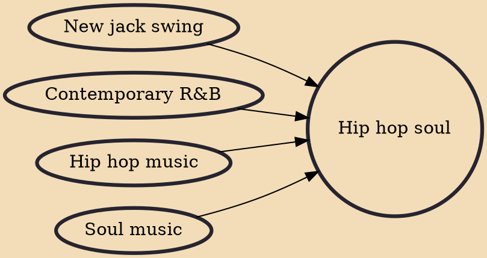

Hip hop soul is a subgenre of contemporary R&B music, most popular during the early and mid 1990s, which fuses R&B or soul singing with hip hop musical production. The subgenre had evolved from a previous R&B subgenre, new jack swing, which had incorporated hip-hop influences into R&B music. By contrast, hip hop soul is, as described in The Encyclopedia of African American Music, "quite literally soul singing over hip hop grooves".

## Influences

- [[New jack swing]]
- [[Contemporary R&B]]
- [[Hip hop music]]
- [[Soul music]]
