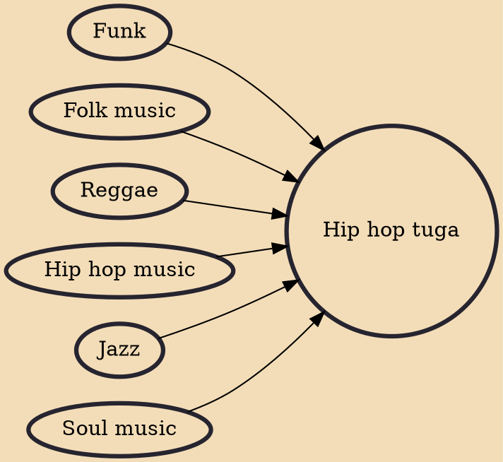

Portuguese hip hop (Hip hop português), more commonly called hip hop tuga ("tuga" here being a slang for "Portuguese"), is the Portuguese variety of hip hop music. It differs from mainstream hip hop because it has strong influences from African music, from Lusophone Africa, reggae, zouk and fado. Artists such as Valete and Sam the Kid are among the most popular. Old school Portuguese hip hop artists include General D, Chullage, Boss AC, , Dealema, Fuse, Mundo Segundo, Regula, Da Weasel, Allen Halloween and Sir Scratch.

## Influences

- [[Funk]]
- [[Folk music]]
- [[Reggae]]
- [[Hip hop music]]
- [[Jazz]]
- [[Soul music]]
