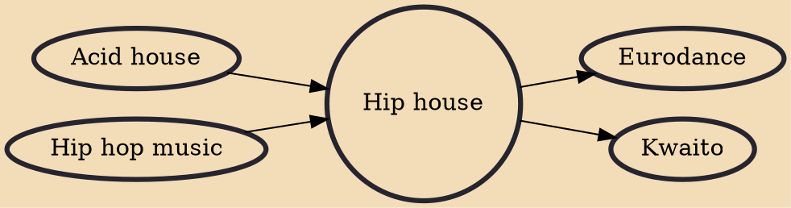

Hip house, also known as rap house or house rap, is a musical genre that mixes elements of house music and hip hop, that originated in both London, United Kingdom and Chicago, United States in the mid to late 1980s. British group the Beatmasters' "Rok da House" is known to be the very first hip house record, having been written and pressed to vinyl in August 1986. Other early hip house records by British artists include "Pump Up the Volume" by MARRS and "Beat Dis" by Bomb the Bass, both from 1987.

## Influences
- [[Acid house]]
- [[Hip hop music]]

## Derivatives
- [[Eurodance]]
- [[Kwaito]]
