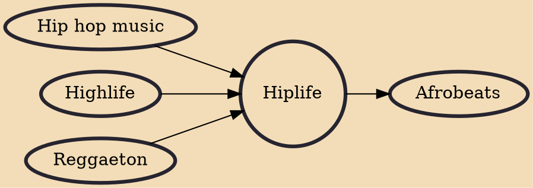

Hiplife is a Ghanaian musical style that fuses Ghanaian culture and hip hop. Recorded predominantly in the Ghanaian Akan language, hiplife is rapidly gaining popularity in the 2010s throughout West Africa and abroad, especially in the United Kingdom, United States, Canada and Germany.

## Influences

- [[Hip hop music]]
- [[Highlife]]
- [[Reggaeton]]

## Derivatives

- [[Afrobeats]]
