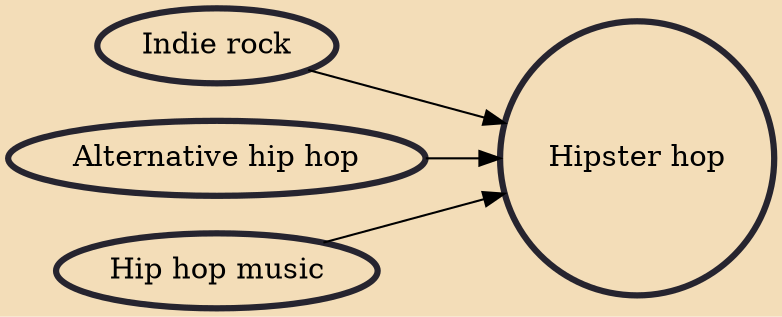

Hipster hop (also known as hipster rap) is a term that was used by music bloggers and critics in the 2000s and early 2010s to describe hip hop music that was perceived to be influenced by the hipster subculture. The term has been applied to artists such as The Cool Kids and Kid Cudi, though it has not been embraced by such artists.

## Influences
- [[Indie rock]]
- [[Alternative hip hop]]
- [[Hip hop music]]
