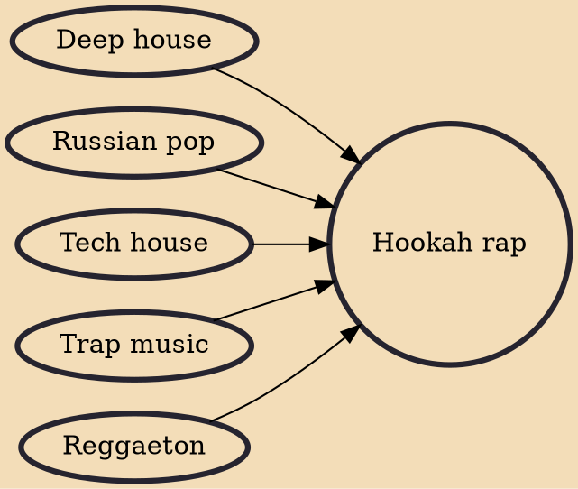

Hookah rap, or hookah pop (Russian: кальян-рэп, tr. kal'yan-rep, IPA: [kalʲjan-rep], Russian: кальянный рэп, tr. kal'yannyy rep, IPA: [kal'jannɪj-rep], Russian: шиша рэп, tr. shisha rep, IPA: [ʃiʃa-rep]), is a genre of Russian rap or Russian pop which originated in Russia during the mid 2010s and popularized across the post-Soviet countries in the late 2010s.

## Influences

- [[Deep house]]
- [[Russian pop]]
- [[Tech house]]
- [[Trap music]]
- [[Reggaeton]]
