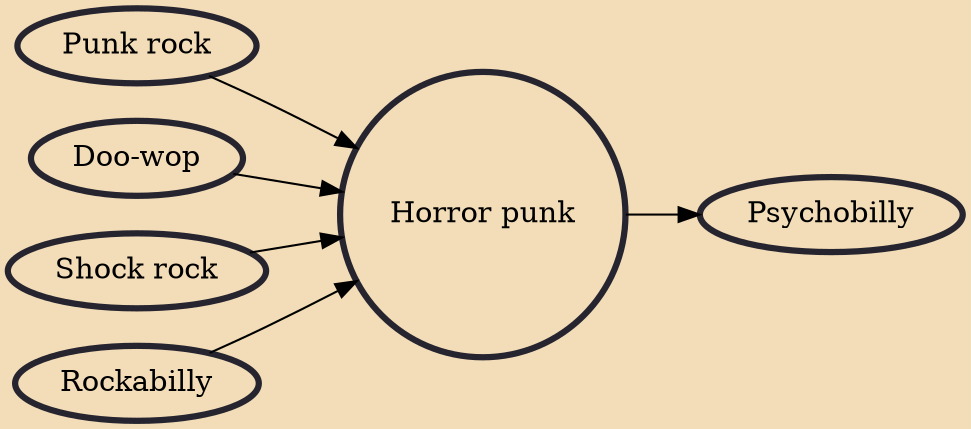

Horror punk is a music genre that mixes punk rock and 1950s-influenced doo-wop and rockabilly sounds with morbid and violent imagery and lyrics which are often influenced by horror films and science fiction B-movies. The genre was pioneered by the Misfits in the late 1970s and early 1980s. Subsequent bands formed in the Misfits' wake like Mourning Noise, the Undead and Samhain, solidifying horror punk's first wave. In the late 1990s and early 2000s the genre gained attention through the reunion of the Misfits and success of groups like AFI, Son of Sam and the Murderdolls. This popularity continued to the modern day with Blitzkid, Calabrese and Creeper.

## Influences
- [[Punk rock]]
- [[Doo-wop]]
- [[Shock rock]]
- [[Rockabilly]]

## Derivatives
- [[Psychobilly]]
