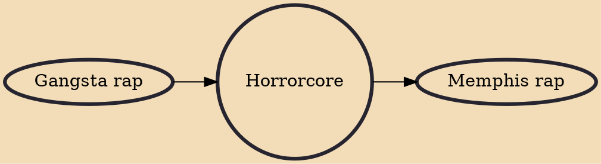

Horrorcore, also called horror hip hop, horror rap, death hip hop, or death rap, is a subgenre of hip hop music based on horror-themed and often darkly transgressive lyrical content and imagery. Its origins derived from certain hardcore hip hop and gangsta rap artists, such as the Geto Boys, which began to incorporate supernatural, occult, and psychological horror themes into their lyrics. Unlike most hardcore hip hop and gangsta rap artists, horrorcore artists often push the violent content and imagery in their lyrics beyond the realm of realistic urban violence, to the point where the violent lyrics become gruesome, ghoulish, unsettling, inspired by slasher films or splatter films. While exaggerated violence and the supernatural are common in horrorcore, the genre also frequently present

## Influences
- [[Gangsta rap]]

## Derivatives
- [[Memphis rap]]
