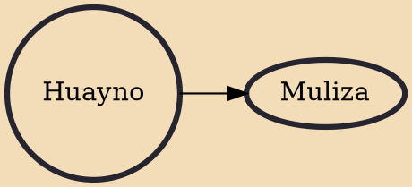

Huayno (Waynu in Quechua) is a genre of popular Andean music and dance. It is especially common in Peru, Bolivia, Northern Argentina and Northern Chile, and is practiced by a variety of ethnic groups, especially the Quechua people. The history of Huayno dates back to colonial Peru as a combination of traditional rural folk music and popular urban dance music. High-pitched vocals are accompanied by a variety of instruments, including quena (flute), harp, siku (panpipe), accordion, saxophone, charango, lute, violin, guitar, and mandolin. Some elements of huayno originate in the music of the pre-Columbian Andes, especially on the territory of the former Inca Empire. Huayno utilizes a distinctive rhythm in which the first beat is stressed and followed by two short beats.

## Derivatives
- [[Muliza]]
